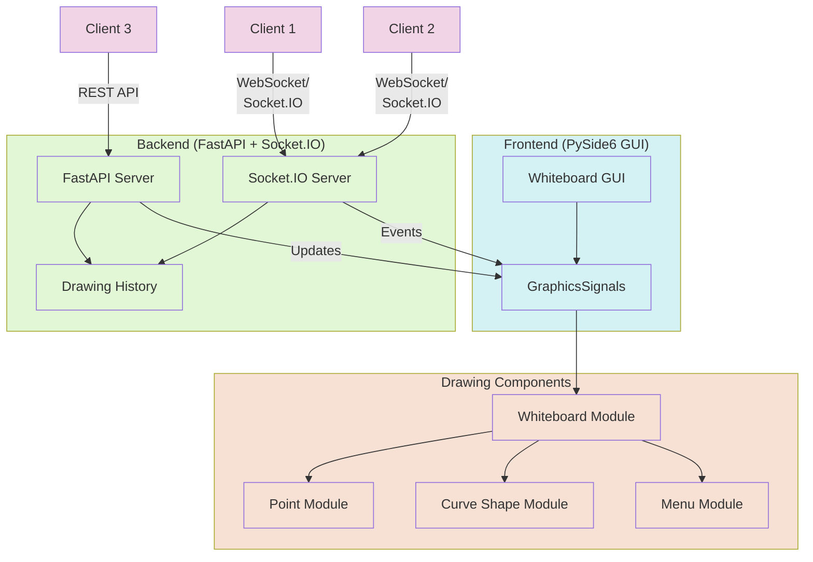

## Architecture Overview

This diagram illustrates the architecture of the draw_app application:

1. **Frontend Layer**
   - PySide6-based GUI for the whiteboard interface
   - GraphicsSignals for event handling between backend and GUI

2. **Backend Layer**
   - FastAPI server handling REST endpoints
   - Socket.IO server for real-time communication
   - Drawing history management

3. **Drawing Components**
   - Point module for coordinate handling
   - CurveShape module for drawing curves
   - Menu module for UI controls
   - Whiteboard module for main drawing functionality

4. **Client Communication**
   - WebSocket/Socket.IO for real-time updates
   - REST API for HTTP-based interactions
   - Multi-client support

5. **Data Flow**
   - Bidirectional communication between clients and server
   - Real-time updates via Socket.IO events
   - State synchronization across all connected clients
